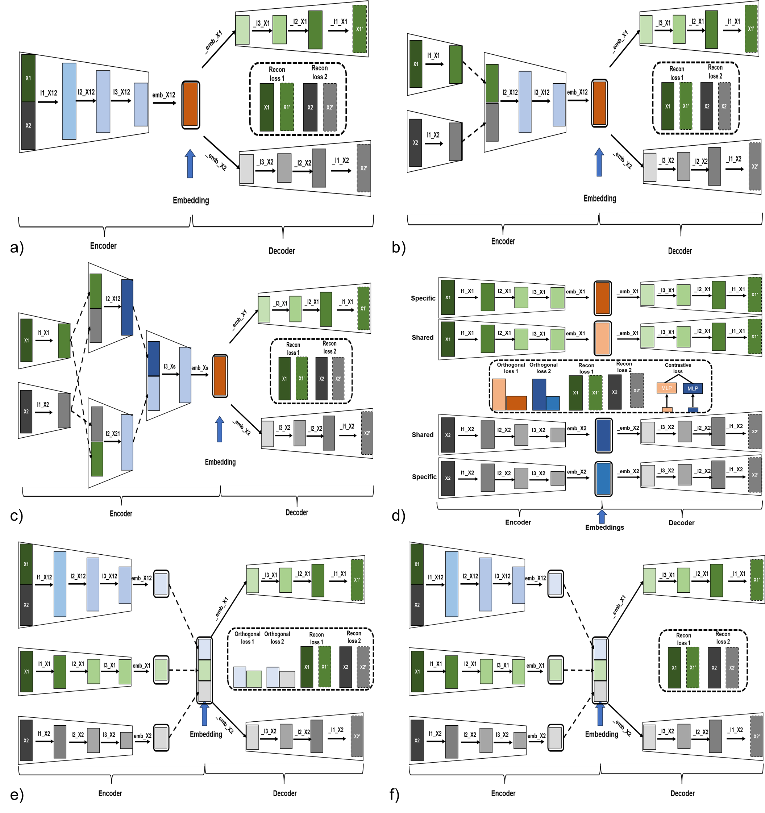

# Auto encoders with shared and specific embeddings for multi-omic data integration

## Organization of this Repository

### The Simulation_Data:
contains the 20 simulation datasets with different levels of difficulties used to compare the 8 AE architectures implemented in this study.

### The Simulation_Models:
contains the implementation of 8 AE architectures used for simulation datasets in this study.

### Simulation_Auxiliary
contains the auxiliary code accompanying the models used for the simulation dataset. 

### The TCGA_Data:
contains the pre-processed TCGA datasets of 6 primary cancer types used to compare the 8 AE architectures implemented in this study and the JIVE model.

### The TCGA_Models:
contains the implementation of 8 AE architectures used for TCGA datasets in this study.

### TCGA_Auxiliary
contains the auxiliary code accompanying the models used for the TCGA dataset. 

### AE model architectures implemented in this study

Fig. Different AE model structures compared in this study. a): AE with direct X1, X2 concatenated together as the model input, referred as CNC AE;
b): AE with processed X1, X2 concatenated together as the model input, referred as X AE; c): AE with different concatenation of processed X1, X2 as
the model input, referred as MM AE; d): AE structure from previous study with orthogonal constraints imposed during the post-processing, referred
as MOCSS [2]; e): AE with both individual and concatenated X1, X2 as the model input with addition imposed orthogonal constraints, referred as
Ortho AE; f): similarly to model in e) without additional orthogonal constraints, referred as NonOrtho AE.

